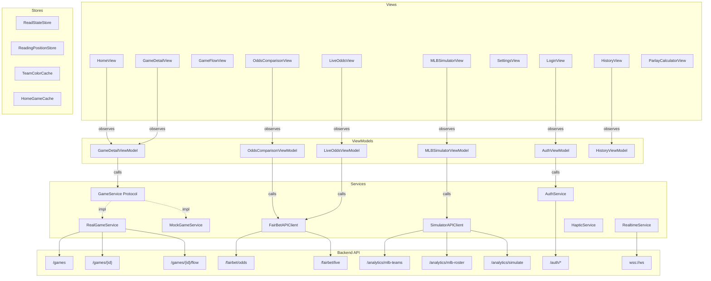

# Architecture

System architecture, data flow, and design principles for the iOS app.

## iOS Data Flow



Views never call services directly. ViewModels mediate all data access.

The app is a **thin display layer**. The backend computes all derived data (period labels, play tiers, odds outcomes, team colors, merged timelines). ViewModels read pre-computed values and expose them to views.

## Core Principles

- **Progressive Disclosure** — reveal information in layers, not all at once
- **Reveal Principle** — scores are hidden by default; user controls when to see them
- **User-Controlled Pacing** — scroll through a game at your own speed
- **Server-Driven Data** — the backend is the SSOT for all derived computation

## API Endpoints

All requests use `X-API-Key` header. Base URL: `sports-data-admin.dock108.ai`.

| Endpoint | Method | Purpose |
|----------|--------|---------|
| `/api/admin/sports/games` | GET | Game list (league, date filters) |
| `/api/admin/sports/games/{id}` | GET | Full game detail |
| `/api/admin/sports/games/{id}/flow` | GET | Narrative flow blocks |
| `/api/admin/sports/games/{id}/pbp` | GET | Play-by-play events |
| `/api/admin/sports/teams` | GET | Team list with colors |
| `/api/fairbet/odds` | GET | Pre-game odds with EV |
| `/api/fairbet/live/games` | GET | Live games with odds |
| `/api/fairbet/live` | GET | Live odds for a game |
| `/api/fairbet/parlay/evaluate` | POST | Parlay fair odds evaluation |
| `/api/analytics/mlb-teams` | GET | MLB teams for simulator |
| `/api/analytics/mlb-roster` | GET | Team roster (batters + pitchers) |
| `/api/analytics/simulate` | POST | Monte Carlo simulation (10K iterations) |
| `/auth/login` | POST | Email/password login → JWT |
| `/auth/signup` | POST | Account creation → JWT |
| `/auth/me` | GET | Current user profile |

### Authentication

Two auth mechanisms:
- **API Key** (`X-API-Key` header) — used for all game/odds/simulator endpoints. Key stored in `Info.plist` as `SPORTS_DATA_API_KEY`.
- **JWT Bearer** (`Authorization: Bearer <token>` header) — used for `/auth/*` endpoints. Token stored in Keychain.

## Team Color System

Team colors come from two sources:
1. **Bulk fetch** — `TeamColorCache.loadCachedOrFetch()` on app launch, cached in UserDefaults (7-day TTL)
2. **Per-game injection** — API responses include `homeTeamColorLight`/`homeTeamColorDark` fields

Color clash detection prevents two similar team colors in matchup views.

## Flow Rendering

Each `FlowBlock` contains:
- `blockIndex` — position in the flow
- `role` — server-provided semantic role (SETUP, MOMENTUM_SHIFT, etc.)
- `narrative` — 1-2 sentence description
- `miniBox` — player stats for this segment with `blockStars`
- `scoreBefore`/`scoreAfter` — score progression as `[away, home]`

## FairBet Architecture

**Server-side EV (preferred):**
- The server computes `trueProb` via Pinnacle devig and provides per-bet `evConfidenceTier` (`full`/`decent`/`thin`)
- Per-book `evPercent` and `isSharp` annotations enable direct EV display without client computation

**Progressive loading:** `OddsComparisonViewModel.loadAllData()` fetches the first 500-bet page and displays immediately, then loads remaining pages concurrently (max 3 in-flight via `TaskGroup`).

**FairBet sub-tabs:**
- **Pre-game** — standard odds comparison with league/market filters
- **Live** — in-game odds grouped by game with 30s polling refresh
- **Calc** — standalone parlay calculator (manual odds input, EV computation, payout display)

**Parlay builder:**
- Users add legs from the pre-game odds view
- `ParlayCorrelation` detects same-game legs and opposing sides
- EV calculation: user inputs book's offered parlay odds, app computes `(fairProb × decimalOffered - 1) × 100`
- Fair probability: independent multiplication of leg probabilities
- Confidence: degrades for correlated legs (same `gameId`) or 4+ legs

## MLB Simulator Architecture

```
User selects teams → fetchRoster() for each
    → Optional lineup customization (9 batters + SP)
    → POST /api/analytics/simulate (10K iterations)
    → SimulatorResult with:
        - Win probabilities
        - Expected scores
        - Most common final scores
        - PA outcome distributions
        - Pitcher profiles (raw + adjusted)
```

**Game playback visualization:** `SimFrameGenerator` creates a frame-by-frame game replay from the simulation's PA probability distributions, targeting the most likely final score. `DiamondFieldView` renders an animated baseball diamond with player silhouettes, base runners, and outcome labels. Playback supports play/pause, step forward/back, with haptic feedback.

## Realtime Architecture

`RealtimeService` manages a WebSocket connection to `wss://sports-data-admin.dock108.ai/v1/ws`.

- Exponential backoff reconnect (1s initial, 30s max)
- Channel-based subscriptions: `games:{league}:{date}`, `game:{id}:summary`, `fairbet:odds`
- Degrades to `ConnectionState.degraded` after 2 failures within 60s
- Initialized on app launch in `ScrollDownApp`

## Auth Architecture

`AuthService` (actor) handles all auth API calls. JWT tokens stored in Keychain.

`AuthViewModel` (singleton, `@MainActor`):
- Validates existing session on app launch
- Manages login/signup/logout flows
- Exposes `role: UserRole` (.guest/.user/.admin) for feature gating

Role-based gating:
- Admin features (history browsing) gated by `authViewModel.isAdmin`
- Guest users see full app with sign-in prompt in Settings

## Sport-Specific Models

| Model | Sport | Fields |
|-------|-------|--------|
| `NHLSkaterStat` | NHL | TOI, G, A, PTS, +/-, SOG, HIT, BLK, PIM |
| `NHLGoalieStat` | NHL | TOI, SA, SV, GA, SV% |
| `MLBBatterStat` | MLB | AB, H, R, RBI, HR, BB, K, SB, AVG, OBP, SLG, OPS |
| `MLBPitcherStat` | MLB | IP, H, R, ER, BB, K, HR, ERA, pitch count |
| `MLBAdvancedTeamStats` | MLB | Pitches, BIP, exit velo, hard hit%, barrel%, z-swing%, o-swing%, z-contact% |

## Configuration

```swift
AppConfig.shared.environment  // .live (default), .localhost, or .mock
AppConfig.shared.gameService  // Returns appropriate service implementation
AppConfig.shared.apiBaseURL   // Environment-specific base URL
```

## Game Status Lifecycle

Key behavior:
- **Live games:** ViewModel polls every ~45s, shows PBP as primary content, auto-stops on dismiss or final transition
- **Final games:** Shows Game Flow as primary content (falls back to PBP if no flow data)
- **Read state gating:** `markRead` requires a `GameStatus` and silently ignores non-final games

## Haptic Feedback

All haptic feedback goes through `HapticService` (centralized SSOT):
- `HapticService.impact(.medium)` — button presses, score reveals
- `HapticService.notification(.success)` — simulation complete
- `HapticService.selection()` — tab switches, stepper changes

No direct `UIImpactFeedbackGenerator` calls outside `HapticService`.

## Home View Tabs

`HomeViewMode` enum controls the main segmented picker:

| Tab | Content | ViewModel |
|-----|---------|-----------|
| Games | Game list with date sections | HomeView state |
| FairBet | Odds comparison (pre-game/live/calc sub-tabs) | OddsComparisonViewModel, LiveOddsViewModel |
| Simulator | MLB Monte Carlo simulator | MLBSimulatorViewModel |
| Settings | Preferences, account, admin features | AuthViewModel |
